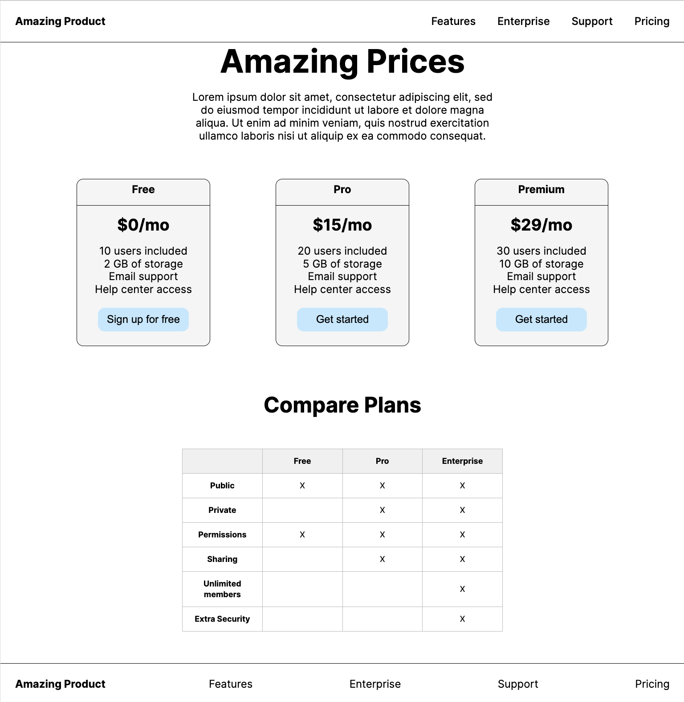
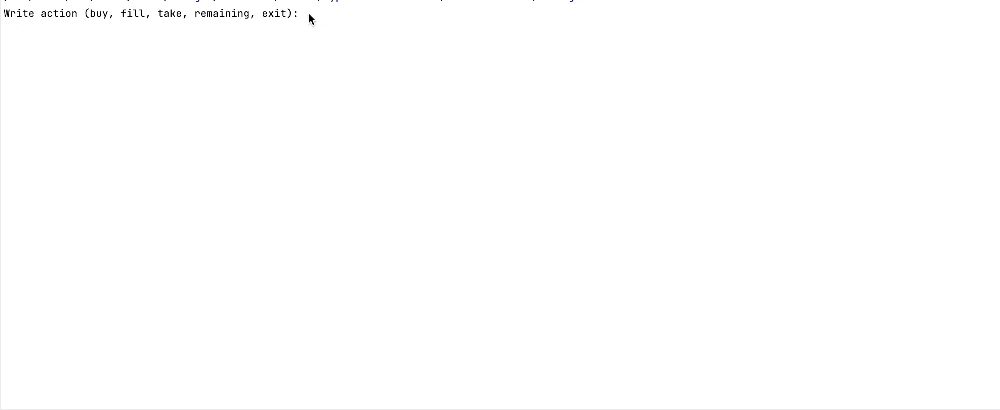
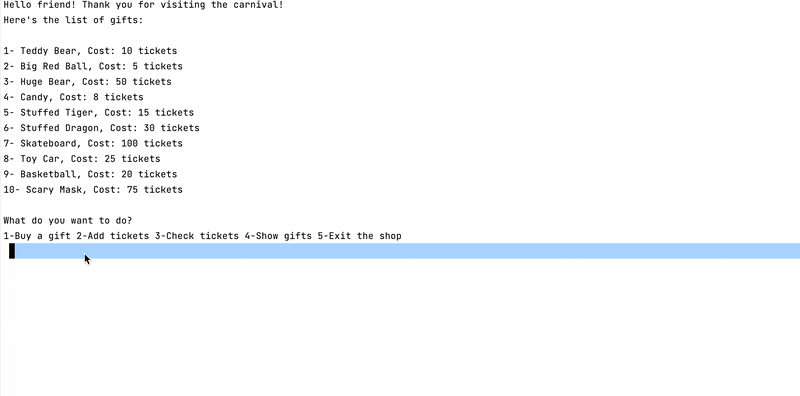
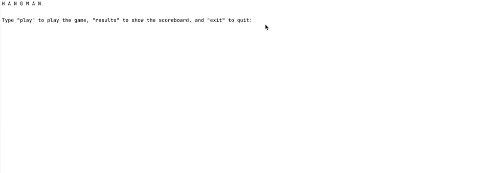
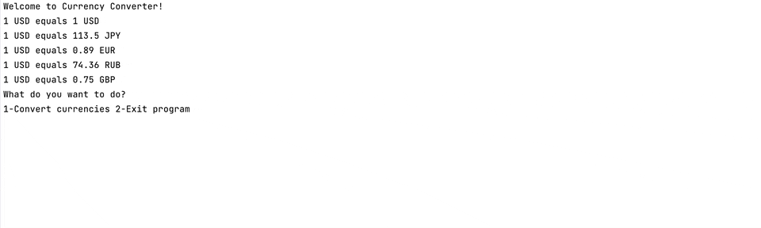

<!DOCTYPE html>
<html>
<head>
    <meta charset="UTF-8">
</head>
<body>

    <h1>Hyperskill projects (Frontend)</h1>
    

        

            

                <b>Об этом репозитории</b>
            

            <ul>
                

                    Этот репозиторий представляет собой сборник 
                    выполненных проектов Frontend-трека с образовательной платфорымы JetBrains - hyperskill.org. 
Разумеется, подобное использование git-репозитория несколько расходится с общепринятым, в котором одному репозиторию 
                    соотвествует один проект. Однако, преследуемая при создании цель - собрать результаты обучения на hyperskill в одном месте, а не множить сущности (репозитории).
                

            </ul>
        

  

            

                <b>About this repository</b>
            

            <ul>
                

This repository is a collection of completed Frontend track projects from the JetBrains educational platform - hyperskill.org.
Of course, this use of a git repository is somewhat at odds with the generally accepted one, in which one repository corresponds to one project. However, the goal pursued during creation is to collect the results of hyperskill training in one place, and not to multiply entities (repositories).
                

            </ul>
        

    

        <h2>Contents | Содержание</h2>
        <ul>
                <h4>⬛ Project: <a href="https://github.com/ale-sanches/hyperskill-frontend/tree/release/flashcard/flashcards">Flashcards</a></h4>
            <ul>
                

                    
                    
                    
                    
                     
                    Page with flashcards, each containing a question on one side and the answer on the other.  
                    Project link to Hyperskill: <a href="https://hyperskill.org/projects/115?track=34">click</a>  
                

                    

                    
<b>Preview</b>

                    
                    

            </ul>
            <h4>⬛ Project: 
                <a  
                    href="https://github.com/ale-sanches/hyperskill-frontend/tree/release/amazing-prices/amazing-prices">
                    Amazing Prices</a>
            </h4>
            <ul>
                

                    
                    
                    
                    
                     
                    A page layout for the pricing of a service or a product. Practice frontend skills using HTML & CSS and build a page based on Figma designs. 
                    Project link to Hyperskill: <a href="https://hyperskill.org/projects/309?track=34">click</a>  
                
                    
                      

                    
<b>Preview</b>

                    
                    

            </ul>
            <h4>⬛ Project: 
                <a  
                    href="https://github.com/ale-sanches/hyperskill-frontend/tree/release/coffee-machine/coffee-machine">
                    Coffee Machine</a>
            </h4>
            <ul>
                

                    
                    
                    
                    
                     
A console coffee machine simulator. This machine uses regular ingredients — coffee, milk, and plastic cups. 
Should it run out of something, it will show you a notification. Our device will serve espresso, cappuccino, and latte. 
And since nothing is for free, it will also charge coffee lovers for a cup.       
Project link to Hyperskill: <a href="https://hyperskill.org/projects/220?track=32">click</a>  
   
                       

                    
<b>Preview</b>

                    
                    

            </ul>
<h4>⬛ Project: 
                <a  
                    href="https://github.com/ale-sanches/hyperskill-frontend/tree/release/carnival-gift-shop/carnival-gift-shop">Carnival Gift Shop
                    </a>
            </h4>
            <ul>
                

                    
                    
                    
                     
                   The program shows the list of gifts, the tickets you have, and buy the gift you want.       
                    Project link to Hyperskill: <a href="https://hyperskill.org/projects/277?track=65">click</a>  
                      

                    
<b>Preview</b>

                

            </ul>
<h4>⬛ Project: 
                <a  
                    href="https://github.com/ale-sanches/hyperskill-frontend/tree/release/hangman/hangman">Hangman
                    </a>
            </h4>
            <ul>
                

                    
                    
                    
                    
                     
                    Hangman is a popular yet grim puzzle game. A cruel computer hides a word from you, which you 
                    try to guess letter by letter. 
                    If you fail, you'll be “hanged”. If you win, you'll survive.        
                    Project link to Hyperskill: <a href="https://hyperskill.org/projects/265?track=32">click</a>  
                      

                    
<b>Preview</b>

                

            </ul>
<h4>⬛ Project: 
                <a  
                    href="https://github.com/ale-sanches/hyperskill-frontend/tree/release/simple-currency-converter/simple-currency-converter">Simple Currency Converter
                    </a>
            </h4>
            <ul>
                

                    
                    
                    
                    
                     
                    A program that converts a provided currency to another.        
                    Project link to Hyperskill: <a href="https://hyperskill.org/projects/231?track=32">click</a>  
                      

                    
<b>Preview</b>

                

            </ul>
        </ul>
    

</body>
</html>
